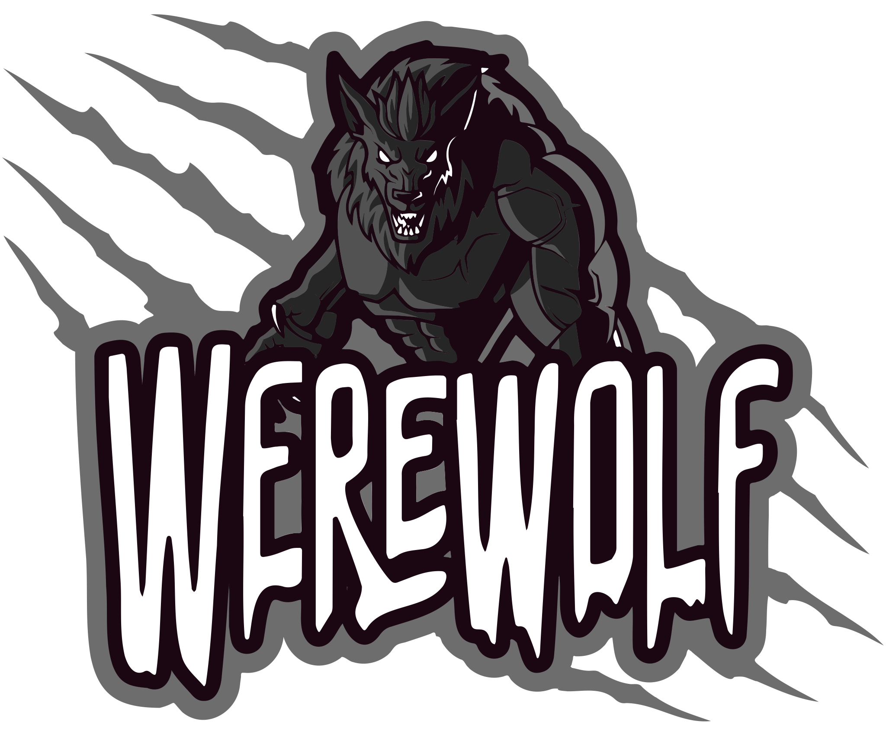

# Werewolf - The Game

All initial contributors were working at the same company and once (during Corona lockdown between April and July 2020)
decided to play remote games to stay connected and have fun together. Since we already were used to play Werewolf in
real life before Corona, we found ourself searching for a good alternative.

Simply: there was no good one. Yes, there were some good ideas, but nothing we as developer would accept in long term
because all available games had a lot of bugs, or we were forced to play with strangers.

So we decided to code something completely new. Let's be hones: we gonna steal a lot of ideas from existing games and
want to get the best out of it! Here are the planned features:

- Multiple rooms / sessions
- easy to handle setup
- easy to use GUI and nice user experience
- using NodeJS as learning for our frontend developers
- using React as learning for our backend developers
- using React Hooks although we're all very happy with class components
- using Typescript to annoy the hell out of *us all* since the learning curve is extremely steep - but FUN! :-D 

## How to start

After installing all dependencies with executing `yarn` (or the equivalent npm command),

use `yarn backend:start` to start the nodejs server which handles all socket connections and the gameplay.

Then use `yarn frontend:start` to start the... wait for it... FRONTEND! (what a surprise!)

## Contribute

As we already noticed: This is mainly a project for our personal fun and learning curve. We're not expecting anybody
to really contribute outside of our company. Still, we want to make this repository publicly available... simply
because we love the game, and our dedication to learn new stuff!
